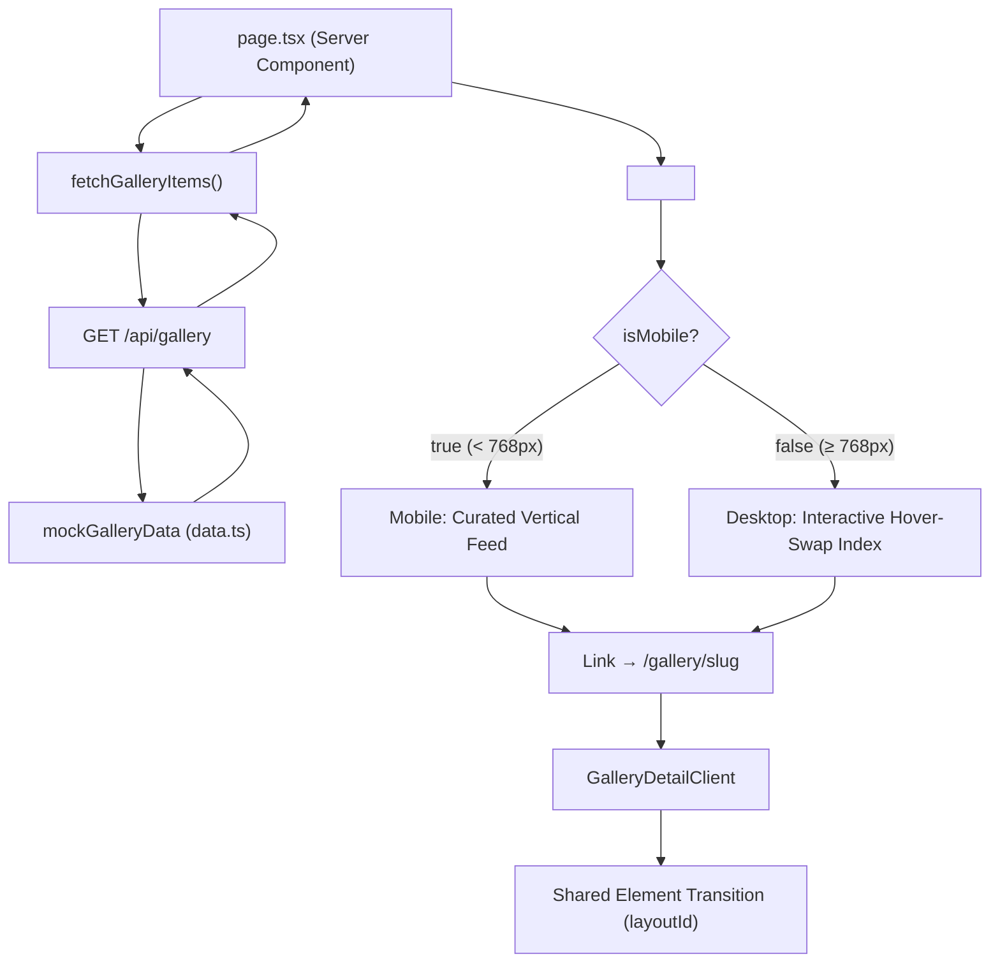

# SOFTWARE DESIGN DOCUMENT (SDD) — REVISI 3.0
**Proyek:** Immersive Interactive Gallery  
**Nama Kode:** ARTELAB VOL. 3 — MIRAGE  
**Fase:** Eksekusi Tahap 3 (First Impression Architecture & Ecosystem)  
**Tanggal:** 3 April 2026  
**Status:** ✅ FINAL — *Ecosystem Lengkap, Animasi Sinematik Terpasang, Siap Produksi*

---

## 1. Ringkasan Eksekutif

Dokumen ini adalah **Software Design Document (SDD)** revisi terkini yang mencerminkan kondisi *codebase* aktual setelah dua kali iterasi mayor. Semua artefak teknis yang direferensikan di sini telah **diimplementasikan dan diverifikasi** — bukan rencana, melainkan dokumentasi dari sistem yang sudah berjalan.

### 1.1 Perubahan Kunci dari SDD v2.0 ke v3.0

| Aspek | Evolusi SDD v3.0 |
|---|---|
| **First Impression** | Memperkenalkan `IntroOverlay` dengan efek *Cinematic Focus Pull* & *Rapid Reel Montage*. |
| **Homepage Architecture** | *Single-Page Flow* — Integrasi Hero Landing Section Lobi Raksasa (`100dvh`) di atas Feed. |
| **Menu Mobile** | Re-desain menjadi *Full-Screen Immersive Overlay* dengan transisi teatrikal + Social Footer. |
| **Ecosystem Pages** | Inklusi halaman ekosistem korporat: `/about` (Pillar grid), `/contact` (Form kaca), `/campaigns` (Vertical timeline). |

---

## 2. Ekosistem Teknologi

### 2.1 Dependensi Produksi

| Library | Versi | Fungsi |
|---|---|---|
| `next` | 16.2.2 | Framework SSR/SSG. App Router, Server Components, Route Handlers |
| `react` / `react-dom` | 19.2.4 | UI Runtime |
| `framer-motion` | ^11.15.0 | Shared Element Transition (`layoutId`), `AnimatePresence`, stagger orchestration |
| `gsap` | ^3.12.5 | GSAP Core untuk animasi floating, parallax `ScrollTrigger` |
| `lenis` | ^1.1.18 | Smooth scroll engine (membajak native scroll menjadi buttery-smooth) |
| `zustand` | ^5.0.2 | State management ringan (menu open/close, active gallery ID) |
| `lucide-react` | ^0.469.0 | Ikon vektor (Menu, X, ArrowLeft) |
| `clsx` + `tailwind-merge` | ^2.x | Utility penggabung class Tailwind secara aman |

### 2.2 Dependensi Pengembangan

| Library | Versi | Fungsi |
|---|---|---|
| `tailwindcss` | ^4 | CSS Utility-first engine |
| `@tailwindcss/postcss` | ^4 | PostCSS integration |
| `typescript` | ^5 | Tipe statis |
| `eslint` + `eslint-config-next` | ^9 / 16.2.2 | Linting |

---

## 3. Arsitektur Sistem

### 3.1 Peta Direktori Aktif

```
src/
├── app/
│   ├── layout.tsx              # Root Layout (SmoothScrollWrapper + Navbar)
│   ├── page.tsx                # Homepage entry → <ImmersiveHomepage />
│   ├── globals.css             # Design tokens, flowGrid keyframe
│   ├── about/page.tsx          # Halaman Ekosistem: Tentang Kami
│   ├── campaigns/page.tsx      # Halaman Ekosistem: Timeline Kampanye
│   ├── contact/page.tsx        # Halaman Ekosistem: Hubungi Kami
│   ├── api/
│   │   └── gallery/
│   │       └── route.ts        # GET /api/gallery — paginated mock data
│   └── gallery/
│       └── [slug]/
│           ├── page.tsx        # Detail page Server Component
│           └── GalleryDetailClient.tsx  # Detail page Client Component
├── components/
│   ├── layout/
│   │   ├── Navbar.tsx          # Full-screen Immersive Overlay Navigation
│   │   └── SmoothScrollWrapper.tsx  # Lenis + GSAP ScrollTrigger bridge
│   ├── sections/
│   │   ├── ImmersiveHomepage.tsx    # ⭐ KOMPONEN UTAMA (Hero Lobi + Feed + IntroOverlay)
│   └── ui/
│       ├── GalleryItem.tsx          # [DORMANT] Card individual (tidak dipakai di homepage baru)
│       ├── ParallaxImage.tsx        # Gambar + GSAP ScrollTrigger parallax
│       └── HoverAccordion.tsx       # Accordion interaktif (dipakai di halaman detail)
├── hooks/
│   └── use-reduced-motion.ts   # Deteksi preferensi aksesibilitas pengguna
├── lib/
│   ├── api.ts                  # Fetch wrapper (fetchGalleryItems, fetchGalleryItemBySlug)
│   ├── data.ts                 # Mock data — 9 entri dengan foto asli
│   ├── store.ts                # Zustand global store
│   └── utils.ts                # cn() — clsx + tailwind-merge
└── types/
    └── index.ts                # Interface TypeScript (GalleryItem, GalleryImage, dll.)
```

### 3.2 Diagram Alur Data



---

## 4. Spesifikasi Komponen

### 4.1 `ImmersiveHomepage.tsx` — Jantung Aplikasi

**Lokasi:** `src/components/sections/ImmersiveHomepage.tsx`  
**Tipe:** Client Component (`"use client"`)  
**Peran:** Komponen monolitik yang me-*render* dua mode tampilan berdasarkan ukuran layar.

#### State Internal

| State | Tipe | Default | Fungsi |
|---|---|---|---|
| `activeIndex` | `number` | `0` | Indeks item galeri yang sedang aktif/dipilih |
| `isMobile` | `boolean` | `true` | Deteksi breakpoint (< 768px). Default `true` untuk mencegah *flash of desktop content* di SSR |

#### Mode Render: Global / First Impression (Semua Ukuran Layar)

Sebuah `IntroOverlay` mengintersep tampilan awal sebelum pengguna diizinkan melihat galeri:
1. **Fase Text (0-2.3d):** Menyajikan frasa tipografi *"Setiap Karya Punya Cerita"* yang memudar masuk menggunakan efek optikal *blur* dramatis.
2. **Fase Reel (2.3-3.5d):** Teks hilang, digantikan oleh *Rapid Reel* 3 kolom berisi cuplikan mahakarya yang bergulir kilat dari bawah ke atas (`y: -150vh`) dengan kemiringan `-5deg` dan *tone sepia* untuk ilusi kecepatan pita film.
3. **Fase Curtain Rise:** Papan hitam utuh memisahkan dan terangkat (`y: -100%`) membedah keanggunan sejati *Hero Section*. Intro ini diingat melalui persetujuan sesi peramban (`sessionStorage`) sehingga tidak direpetisi jika pengguna berpindah ruang.

#### Mode Render: Mobile (< 768px)

```
┌─────────────────────────────┐
│         NAVBAR              │
├─────────────────────────────┤
│  ┌───────────────────────┐  │
│  │     HERO LOBI (100dvh)│  │ ← Cinematic Ken Burns & Scroll Pillar
│  └───────────────────────┘  │
│  ┌───────────────────────┐  │
│  │                       │  │
│  │     FOTO BESAR #1     │  │ ← aspect-[3/4], rounded-[2rem]
│  │     (Tap to View)     │  │ ← layoutId="gallery-image-{id}"
│  │                       │  │
│  └───────────────────────┘  │
│  Category • JUDUL TEBAL     │
│  Deskripsi singkat...       │
└─────────────────────────────┘
```

**Perilaku:**
- Dimulai dengan **Hero Lobi Single-Page** `100dvh` diisi animasi perlahan gambar pertama tanpa henti dan pemicu jari di ranah bawah.
- Di bawah Hero, tersedia **Pills Kategori Horisontal** untuk jangkar navigasi instan.
- Setiap foto direkayasa sentuh; dengan sentuhan (Tap/WhileTap), skala menyusut `0.96` berisikan Lencana `"Tap to View"` melayang.
- TAP foto → navigasi ke `/gallery/[slug]` via `<Link>` dengan Shared Element Transition (`layoutId`).
- Kepatuhan SDD: *Zero Hover di Perangkat Sentuh*. Penuh interaksi kinetik (Lenis scroll sinkron).

#### Mode Render: Desktop (≥ 768px)

```
┌──────────────────────────────────────────────────────────┐
│  NAVBAR                                                   │
├────────────────┬─────────────────────────────────────────┤
│                │          ┌────┐                          │
│ Works / Mirage │    ┌─────┤IMG │   ┌────┐                │ ← Scattered
│                │    │ IMG ├────┘   │IMG │                 │    ambient images
│ VIVID DIMENS.. │    └─────┘       └────┘                 │    (GSAP floating)
│ CLASSICAL AU.. │                                          │
│ ▓ETERNAL GAZE▓ │    ┌──────────────────────────┐         │
│ MYTHIC LORE    │    │                          │         │ ← Focal Image
│ KNOWLEDGE VA.. │    │      GAMBAR UTAMA         │         │    (hover-swap)
│ EUROPEAN CH..  │    │      (16:10 ratio)        │         │
│ SERENE PASS..  │    │                          │         │
│ WINTER MIRAGE  │    └──────────────────────────┘         │
│ CITY ECHOES    │               ↑ Klik = Detail Page      │
│                │                                          │
│ Hover & Click  │                                          │
└────────────────┴─────────────────────────────────────────┘
```

**Perilaku:**
- **Left Panel (1/3):** Daftar vertikal nama proyek. `onMouseEnter` → langsung `setActiveIndex(idx)` tanpa klik. Item aktif ditandai border kuning + indent kiri. `onClick` → navigasi ke halaman detail.
- **Right Panel (2/3):** Focal image raksasa (`aspect-[16/10]`) berganti via `AnimatePresence mode="wait"` dengan transisi `blur(15px) + x:80 → blur(0) + x:0`. Hover pada gambar memunculkan overlay informasi + tombol "Explorasi".
- **Background:** 4 gambar tersebar (*scattered*) yang berubah dinamis sesuai `activeIndex`, melayang mengambang via GSAP `y/x/rotation random` yoyo.

### 4.2 `Navbar.tsx` — Navigasi Global

**Lokasi:** `src/components/layout/Navbar.tsx`  
**Tipe:** Client Component

| Fitur | Desktop | Mobile |
|---|---|---|
| Posisi | `fixed top-0` dengan mix-blend estetis eksklusif |
| Menu | Navigasi meluas *overlay* `100dvh` (Tampilan penuh di kedua perangkat) |
| Animasi Overlay | *Curtain Draw* terselubung via Framer `AnimatePresence`. Mengaburkan dan menutup layar di belakang. |
| Animasi Menu | *Stagger Reveal* beruntun `y: 50 -> 0`. Link menari bergoyang saat dilewati *mouse*. |
| Elevasi Arsitektur | Dilengkapi komponen teratur *Dividers* pembelah halaman dan _Social Contact Footer_ dinamis di dasarnya. |

**State:** Menggunakan Zustand store (`useStore`) untuk mentransfer status navigasi (`isMenuOpen`) demi menjaga *scroll blocking* dokumen tubuh (`document.body.style.overflow`).

### 4.3 `GalleryDetailClient.tsx` — Halaman Detail Proyek

**Lokasi:** `src/app/gallery/[slug]/GalleryDetailClient.tsx`  
**Tipe:** Client Component

**Fitur Utama:**
- **Hero Image:** `motion.create(Image)` dengan `layoutId="gallery-image-{id}"` — menerima elemen transisi dari homepage (Shared Element / Magic Motion).
- **Spring Physics:** `type: "spring", stiffness: 300, damping: 30` — memberikan feel fisik saat gambar "mendarat" di posisi hero.
- **Navigasi Kembali:** Tombol `<ArrowLeft>` di pojok kiri atas.
- **Content:** Metadata (Author, Date), dan `<HoverAccordion>` dengan 3 tab konteks (Manifesto, Filosofi Desain, Teknik Visual).

### 4.4 `SmoothScrollWrapper.tsx` — Smooth Scroll Engine

**Lokasi:** `src/components/layout/SmoothScrollWrapper.tsx`

**Konfigurasi Lenis:**
```typescript
{
  duration: 1.2,
  easing: (t) => Math.min(1, 1.001 - Math.pow(2, -10 * t)),  // Exponential ease-out
  orientation: "vertical",
  smoothWheel: true,
  wheelMultiplier: 1,
  touchMultiplier: 2     // Lebih responsif di perangkat sentuh
}
```

**Bridge ke GSAP:** Setiap frame `requestAnimationFrame`, Lenis memperbarui posisi scroll, lalu `ScrollTrigger.update()` dipanggil agar semua animasi berbasis scroll tetap sinkron.

**Degradasi Aksesibilitas:** Jika `useReducedMotion()` bernilai `true`, Lenis tidak diinisialisasi sama sekali; scroll kembali ke perilaku bawaan browser.

### 4.5 `ParallaxImage.tsx` — Gambar Paralaks GSAP

**Lokasi:** `src/components/ui/ParallaxImage.tsx`

**Mekanisme:**
1. Gambar di-*set* awal `scale: 1.1` dan `yPercent: -speed*50`.
2. Saat pengguna scroll, GSAP `ScrollTrigger` mengubah `yPercent` secara linear (`scrub: true`) dari titik negatif ke positif, menciptakan efek paralaks.
3. Kecepatan diambil langsung dari data backend (`item.interactions.parallaxSpeed`).
4. `overflow: hidden` pada wrapper mencegah tepi gambar keluar.

> **Catatan:** Komponen ini saat ini digunakan oleh `GalleryItem.tsx`, yang statusnya *dormant* (tidak aktif dipakai di homepage, tapi masih tersedia untuk halaman lain).

### 4.6 `HoverAccordion.tsx` — Accordion Interaktif

**Lokasi:** `src/components/ui/HoverAccordion.tsx`

**Dual Behavior:**
- **Mobile:** Vertikal stack. Tap untuk buka/tutup. Tidak ada `onMouseEnter`.
- **Desktop:** Horizontal stack (`md:flex-row`). Hover mengaktifkan panel. Panel aktif mendapat `grow-[3]`, panel lainnya `grow-[1]`. Teks miring 90° pada panel non-aktif.

---

## 5. Sistem Data & API

### 5.1 Route Handler: `GET /api/gallery`

**File:** `src/app/api/gallery/route.ts`

| Parameter | Tipe | Default | Deskripsi |
|---|---|---|---|
| `page` | query string | `1` | Nomor halaman |
| `limit` | query string | `10` | Jumlah item per halaman |

**Response:**
```json
{
  "success": true,
  "galleryItems": [ ... ],
  "pagination": {
    "total": 9,
    "page": 1,
    "limit": 10,
    "totalPages": 1
  }
}
```

### 5.2 Model Data (`GalleryItem`)

```typescript
interface GalleryItem {
  id: string;                    // "item-001"
  title: string;                 // "Vivid Dimensions"
  category: string;              // "Architecture"
  slug: string;                  // "vivid-dimensions"
  images: {
    thumbnail: string;           // "/images/adrianna-geo-...jpg"
    fullResolution: string;      // "/images/adrianna-geo-...jpg"
    altText: string;
    dimensions: {
      width: number;             // 800
      height: number;            // 1200
      aspectRatio: string;       // "2/3"
    };
    isLCP?: boolean;             // true → priority loading
  };
  interactions: {
    parallaxSpeed: number;       // 0.2
    accordionDescription: string;
  };
  metadata: {
    author: string;              // "Artelab"
    createdAt: string;           // ISO 8601
  };
}
```

### 5.3 Aset Visual Aktif

Seluruh 9 foto asli tersimpan di `public/images/`:

| # | File | Kategori | Orientasi |
|---|---|---|---|
| 1 | `adrianna-geo-1rBg5YSi00c-unsplash.jpg` | Architecture | Portrait (2:3) |
| 2 | `birmingham-museums-trust-e0wBK0xJXYQ-unsplash.jpg` | Fine Art | Landscape (3:2) |
| 3 | `birmingham-museums-trust-sJr8LDyEf7k-unsplash.jpg` | Portrait | Portrait (3:4) |
| 4 | `birmingham-museums-trust-zWE5pOLWkio-unsplash.jpg` | Fine Art | Landscape (14:9) |
| 5 | `boston-public-library-YoK5pBcSY8s-unsplash.jpg` | Heritage | Portrait (5:7) |
| 6 | `europeana-5TK1F5VfdIk-unsplash.jpg` | Heritage | Square (1:1) |
| 7 | `francesco-bianco-TVsgRyKJDc0-unsplash.jpg` | Landscape | Landscape (16:10) |
| 8 | `henrik-donnestad-t2Sai-AqIpI-unsplash.jpg` | Nature | Portrait (4:5) |
| 9 | `zeynep-sumer-lk3F07BN8T8-unsplash.jpg` | Urban | Portrait (3:4) |

---

## 6. Rekayasa Animasi

### 6.1 Inventaris Animasi Aktif

| ID | Nama | Library | Lokasi | Trigger |
|---|---|---|---|---|
| A1 | **Flowing Grid** | CSS `@keyframes` | `globals.css` + `ImmersiveHomepage` | Otomatis (infinite loop) |
| A2 | **Scattered Float** | GSAP `random` yoyo | `ImmersiveHomepage` (Desktop) | `activeIndex` berubah |
| A3 | **Focal Image Swap** | Framer `AnimatePresence` | `ImmersiveHomepage` (Desktop) | `activeIndex` berubah |
| A4 | **Menu Stagger** | Framer `staggerChildren` | `Navbar` | Menu toggle |
| A5 | **Shared Element** | Framer `layoutId` | `ImmersiveHomepage` → `GalleryDetailClient` | Navigasi rute |
| A6 | **Parallax Scroll** | GSAP `ScrollTrigger` | `ParallaxImage` | User scroll |
| A7 | **Smooth Scroll** | Lenis | `SmoothScrollWrapper` | Otomatis (global) |
| A8 | **Soft Hover Scale** | CSS `transition-transform` | `ImmersiveHomepage` (both modes) | Mouse hover |

### 6.2 Aturan Aksesibilitas Animasi

```typescript
// Hook: src/hooks/use-reduced-motion.ts
const prefersReducedMotion = useReducedMotion();
```

Jika `true`:
- **Lenis** tidak diinisialisasi → scroll kembali ke native.
- **GSAP floating/parallax** di-skip via `if (prefersReducedMotion) return;`.
- **Framer Motion** tidak ter-override secara otomatis (harus manual per-komponen jika dibutuhkan).

### 6.3 Aturan Performa

| Aturan | Detail |
|---|---|
| GPU-Only Transforms | Semua animasi menggunakan `transform` dan `opacity` saja — tidak ada animasi `width`, `height`, `top`, atau `left` |
| Pointer Events | Background layers selalu `pointer-events-none z-0` |
| Mobile GSAP Budget | Mobile mode tidak menjalankan GSAP ambient floating (hemat baterai) |
| `motion-safe:` prefix | Tailwind `animate-flow-grid` hanya aktif jika pengguna tidak memilih *reduced motion* |

---

## 7. State Management (Zustand)

**File:** `src/lib/store.ts`

```typescript
interface GalleryState {
  activeGalleryId: string | null;
  setActiveGalleryId: (id: string | null) => void;
  isMenuOpen: boolean;
  setIsMenuOpen: (isOpen: boolean) => void;
}
```

**Penggunaan:**
- `isMenuOpen` → `Navbar.tsx` (toggle mobile overlay).
- `activeGalleryId` → Tersedia untuk fitur masa depan (misalnya: highlight kartu tertentu di halaman lain).

> **Catatan Desain:** `activeIndex` pada `ImmersiveHomepage` sengaja **tidak** diangkat ke Zustand karena sifatnya lokal (hanya relevan di homepage) dan perubahan state yang sangat cepat (setiap gerakan mouse) akan menyebabkan re-render berlebihan jika ditempatkan di global store.

---

## 8. Panduan Pengembangan Lanjutan

### 8.1 Menambah Item Galeri Baru
1. Tambahkan foto ke `public/images/`.
2. Tambahkan entri baru di array `mockGalleryData` pada `src/lib/data.ts`.
3. Sistem akan otomatis menampilkannya di homepage (baik mobile feed maupun desktop index).

### 8.2 Migrasi ke CMS Sesungguhnya
1. Ganti isi `src/app/api/gallery/route.ts` dengan fetch ke CMS (Sanity, Strapi, dll).
2. `src/lib/api.ts` tidak perlu diubah — ia sudah mengkonsumsi format JSON yang baku.

### 8.3 Menambah Halaman Baru
1. Buat folder di `src/app/[nama-halaman]/page.tsx`.
2. Pastikan ditambahkan ke array menu di `Navbar.tsx`.
3. Layout global (Navbar, SmoothScroll) otomatis ter-wrap via `layout.tsx`.

---

## 9. Perintah Eksekusi

```bash
# Install dependensi
npm install

# Jalankan development server
npm run dev

# Build produksi
npm run build

# Jalankan server produksi
npm start

# Linting
npm run lint
```

---

**PENGESAHAN:**  
Dokumen ini merupakan refleksi akurat 1:1 dari kondisi *codebase* per tanggal 2 April 2026. Setiap komponen, state, animasi, dan alur data yang direferensikan telah **diimplementasikan secara penuh** dan tersedia di repositori proyek. Tidak ada item yang berstatus "rencana" atau "TBD".
